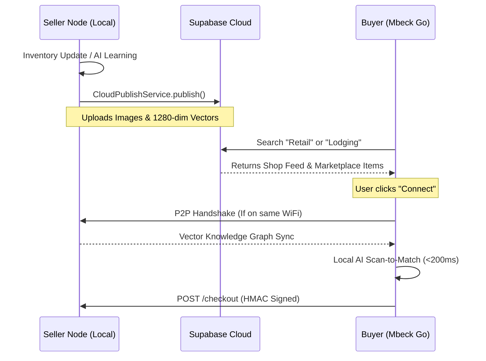

# Mbeck Marketplace: The Unified Commerce Ecosystem

**Status:** Technical Specification & System Overview (v1.2.0)  
**Philosophy:** Heavy Edge, Light Cloud (Hybrid P2P)

---

## 1. Executive Summary
The Mbeck Marketplace is a decentralized commerce protocol designed to bridge the gap between offline-first retail and global digital discovery. Unlike traditional marketplaces that rely on a centralized server for every transaction, Mbeck operates on a **Hybrid Architecture** that prioritizes local-network performance while leveraging the cloud for ecosystem-wide discovery and analytics.

The system enables diverse business verticals—**Retail, Restaurants, Services, Lodging, and Entertainment**—to exist within a single unified catalog, accessible to consumers via the **Mbeck Go (Buyer)** application.

---

## 2. Core Architectural Pillars

### 2.1 The "Heavy Edge" (Seller Node)
Each shop functions as an autonomous server. The merchant's device (Android/Windows) handles:
- **Authority:** The master database (`sqflite`) for all inventory and transactions.
- **AI Engine:** Real-time visual recognition (`EfficientNet-Lite0`) and vector refinement.
- **Local Server:** A background `shelf` web server broadcasting via **mDNS (Bonsoir)**.
- **Privacy:** Customer data and browsing habits remain on the local network.

### 2.2 The "Light Cloud" (Supabase Registry)
The cloud is used strategically as a **Discovery Layer** and **Event Ledger**:
- **Unified Marketplace:** A flattened global catalog (`marketplace_items`) for remote search.
- **Shop Registry:** A centralized directory of shops, their locations, and their business modules.
- **Branding Sync:** Dynamic `theme_config` payloads that allow the Buyer app to morph its UI to match the merchant's brand.

---

## 3. The Marketplace Publishing Pipeline

The **CloudPublishService** is the engine that bridges local data to the global marketplace.

### 3.1 Unified Ledger Flattening
Because Mbeck supports distinct business models, the marketplace flattens complex data into a common structure:
- **Retail:** Maps products to marketplace items.
- **Restaurant:** Maps menu items and prep times.
- **Lodging:** Maps room types and availability.
- **Entertainment:** Maps assets (e.g., Pool Tables) and session-based rates.
- **Services:** Maps service catalogs and booking durations.

### 3.2 Automated Cloud Sync
When a merchant enables "Cloud Publishing," the following occurs:
1. **Auth:** The Seller authenticates anonymously with Supabase.
2. **Metadata Upsert:** Shop identity, active modules, and branding are pushed to the `shops` table.
3. **Asset Upload:** High-resolution product images are moved from local storage to the `marketplace` bucket.
4. **Batch Upsert:** Items are pushed in chunks to the `marketplace_items` table for low-latency indexing.

---

## 4. Discovery & Connectivity

The marketplace supports two distinct discovery flows:

### 4.1 Proximity Discovery (P2P Handshake)
- **Mechanism:** mDNS (UDP 5353) broadcasts on local WiFi.
- **Latency:** <20ms for discovery.
- **Use Case:** "I'm standing in the shop and want to scan items."
- **Sync:** The Buyer downloads the shop's **AI Knowledge Graph** (1280-dim vectors) to perform local visual matching.

### 4.2 Remote Discovery (Cloud Feed)
- **Mechanism:** HTTPS REST queries to Supabase.
- **Latency:** Network dependent (100ms - 500ms).
- **Use Case:** "I'm at home and want to find a hotel or restaurant nearby."
- **Sync:** The Buyer browses the `marketplace_items` ledger and can see live availability (synced periodically by the Seller).

---

## 5. Visual Intelligence & AI Search

Mbeck uses **Visual Embeddings** instead of simple text search:
- **Model:** Quantized `EfficientNet-Lite0`.
- **Vectors:** Each item is represented by a 1280-dimensional float vector.
- **Matching:** Uses **Cosine Similarity**.
- **Offline AI:** The intelligence is "downloadable." Once a Buyer syncs with a shop, they can identify items visually even if their phone has no internet.

---

## 6. Business Verticals (Modules)

The marketplace is modular, allowing a single shop to function as a multi-purpose entity:

| Module | Core Features | Marketplace Impact |
| :--- | :--- | :--- |
| **Retail** | AI Scanner, Stock Audits | Instant visual search & buy. |
| **Restaurant** | Kitchen Display (KDS), Menus | Digital ordering & prep time tracking. |
| **Lodging** | Reservations, Room Mgmt | Real-time booking & check-in. |
| **Entertainment** | Timer Billing (Pool/PS) | Session booking & availability. |
| **Services** | Bookings, Catalog | Professional service scheduling. |

---

## 7. Security & Transaction Integrity

1. **HMAC Signing:** All P2P transactions are signed with a shop-specific secret key. This prevents "Price Tampering" where a user might try to change a $10 item to $1 in the request.
2. **Hash Verification:** The Seller re-computes the transaction hash before committing it to the ledger.
3. **Row Level Security (RLS):** Supabase policies ensure that only authorized sellers can update their inventory, while allowing the public to read marketplace data.
4. **Anonymous Auth:** Sellers can participate in the marketplace without creating traditional email/password accounts, lowering friction for adoption in emerging markets.

---

## 8. Summary of Data Flow

## 9. Business & Ecosystem Economics

The marketplace is designed to be a self-sustaining engine for the "Unorganized Retail" sector:
- **Freemium Onboarding:** Shops can join the marketplace for free, creating a low barrier to entry.
- **SaaS Tiers:** Advanced features like "WhatsApp Receipts," "Unlimited Items," and "Cloud Discovery" are unlocked via monthly subscriptions.
- **Verified Sales Data:** By recording transactions on the unified ledger, shops build a "Financial Identity," allowing them to access inventory financing and micro-lending based on real-time sales performance.

## 10. Trust & Reputation System

To ensure a safe browsing experience in the marketplace:
- **Trust Scores:** Calculated based on successful transactions and verified reviews.
- **Shop Verification:** "Verified" badges for shops that maintain high uptime and valid business details.
- **Immutable Receipts:** Every purchase generates a signed digital receipt, preventing fraud and enabling verified refund processes.

---

## 11. Conclusion
The Mbeck Marketplace is not just an app; it is a **distributed commerce infrastructure**. By moving the "brain" of the shop to the merchant's device and using the cloud only for discovery, Mbeck provides a resilient, high-performance, and privacy-respecting shopping experience that works anywhere, with or without reliable internet.
