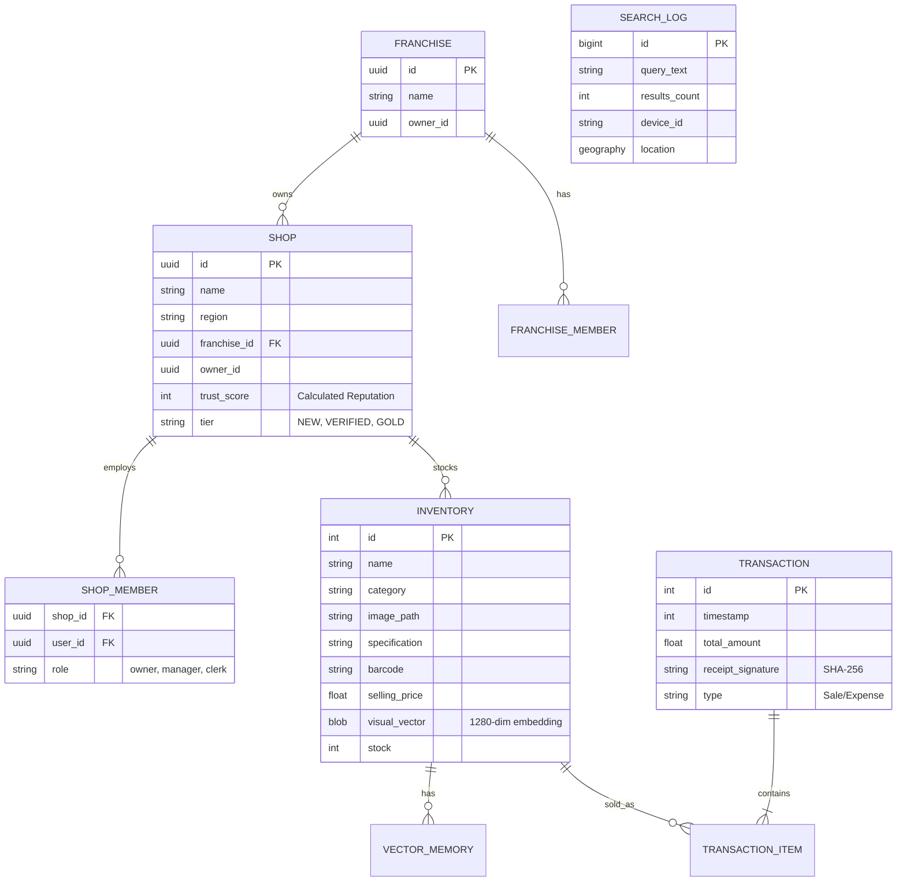

# Mbeck Technical Architecture: Surgical Analysis

**Date:** February 1, 2026  
**Version:** 1.0.0 (Technical Deep Dive)  
**Status:** Architecture Blueprint

---

## 1. System Topology Overview

The Mbeck system operates on a **Local-First, Hybrid-Cloud** topology. The primary computational workload is offloaded to the "Edge" (the Seller's device), which functions as a micro-server for local commerce.

```mermaid
graph TD
    subgraph Local_Network [Local LAN / Hotspot]
        Seller[Seller Device <br/>(Android Host)]
        Buyer1[Buyer Process <br/>(Android/Win/iOS)]
        Buyer2[Buyer Process <br/>(Android/Win/iOS)]
        
        Seller -- "mDNS (UDP 5353)" --> Discovery[Service Discovery]
        Discovery --> Buyer1
        Discovery --> Buyer2
        
        Buyer1 -- "HTTP/WS (JSON)" --> Seller
        Buyer2 -- "HTTP/WS (JSON)" --> Seller
    end
    
    subgraph Cloud_Infrastructure [Supabase Cloud]
        Auth[Auth Service]
        PgSQL[PostgreSQL DB]
        Storage[Bucket Storage]
    end
    
    Seller -. "Sync (HTTPS)" .-> Cloud_Infrastructure
    Buyer1 -. "Reviews/Auth" .-> Cloud_Infrastructure
```

---

## 2. Core Components & Stack

### 2.1 The Seller Engine (`mbeck_seller`)
Acts as the authoritative source of truth for a shop's inventory and transaction history.

*   **Runtime:** Flutter (Dart VM).
*   **Web Server:** `shelf` and `shelf_router` running on a background isolate or async loop to handle incoming Buyer requests without blocking the UI.
*   **Service Discovery:** `bonsoir` broadcasts `_mbeck-pos._tcp`.
*   **Database:** `sqflite` (SQLite 3.x).
    *   **Optimization:** Uses Write-Ahead Logging (WAL) for concurrency.
    *   **Indexing:** Indices on `inventory(visual_vector)`, `inventory(barcode)`, and `txn(timestamp)`.

### 2.2 The AI Perception Pipeline (`AIScannerService`)
This is the differentiating kernel of the architecture. It transforms raw pixel data into semantic vectors.

1.  **Input:** Camera Stream (YUV420) -> Converted to RGB Bitmap -> Resized to 224x224.
2.  **Inference:**
    *   **Model:** `EfficientNet-Lite0` (Quantized int8 or float32).
    *   **Interpreter:** `tflite_flutter` accessing the NPU/GPU delegate where available.
    *   **Output:** A 1280-dimensional float vector (Feature Embedding).
3.  **Vector Search:**
    *   **Metric:** Cosine Similarity.
    *   **Storage:** Vectors stored as JSON strings or Blob arrays in SQLite.
    *   **Query:** For small datasets (<10k), brute-force linear scan in memory is sub-10ms.
    *   **Learning:** "Centroid Update" using Exponential Moving Average (EMA).
        $$ V_{new} = \alpha \cdot V_{scan} + (1 - \alpha) \cdot V_{stored} $$
        *Where $\alpha$ is the learning rate (e.g., 0.1).*

### 2.3 The Feedback Loop (`Search Logs`)
Allows the system to learn from missed opportunities.
*   **Mechanism:** When a Buyer searches for an item (e.g., "Milk") and finds 0 results, the query is logged to `search_logs`.
*   **Analytics View:** `analytics_demand_unmet` aggregates these logs to show "Missed Revenue" opportunities to the Seller.
*   **Privacy:** Logs are anonymous (Device ID only) or aggregated.

### 2.3 The Connectivity Protocol
A custom application-layer protocol enables the "No Internet" commerce.

*   **Discovery Phase:**
    *   Seller Broadcasts: `Name: MbeckShop`, `Port: 8080`, `TXT: {"id": "shop_123"}`.
    *   Buyer Listens: Filters for `_mbeck-pos` and resolves IP.
*   **Handshake:**
    *   GET `/info`: Returns Shop Name, Currency, Version.
*   **Commerce Phase:**
    *   POST `/cart/checkout`: Sends `CartItem[]` list.
    *   Response: `TransactionID`, `Signature`, `Status`.

---

## 3. Data Schema & Models

### 3.1 Entity Relationship Diagram (Simplified)



### 3.2 Key Data Structures (`mbeck_shared`)

*   **InventoryItem:** The atomic unit of commerce.
    *   *Attributes:* `id`, `name`, `stock`, `prices`, `visual_vector`.
    *   *Evolution:* Recently updated to support `specification` and `barcode` for hybrid recognition.
*   **Receipt:** The immutable record of a trade.
    *   *Security:* Contains a cryptographic signature generated by the Seller, verifiable by the Buyer.

---

## 4. Security Architecture

### 4.1 Local Security (Device Level)
Since the Seller App runs on Android/Windows, it relies on the OS sandbox.
*   **Database Encryption (Proposed):** `sqflite_sqlcipher` to encrypt the `.db` file using a key derived from the User's password/PIN.
*   **Traffic Security:** Currently HTTP (Open LAN).
    *   *Refinement:* Move to Self-Signed HTTPS. The Seller generates a cert, Buyer accepts it upon first "Pairing" (TOFU - Trust On First Use).

### 4.2 Application Security (Cloud Level)
When syncing to Supabase:
*   **Authentication:** JWT via Supabase Auth (GoTrue).
    *   **Authorization:** Row Level Security (RLS) policies in PostgreSQL (Enterprise Aware).
    *   `media_read`: Public.
    *   `inventory_write`: Checks `shop_members` (Direct) OR `franchise_members` (Hierarchy). Role must be `manager`, `owner`, or `super_admin`.
    *   `txn_write`: Any authenticated `clerk`, `manager`, or `owner` linked to the shop.

### 4.3 Transaction Integrity
To prevent "receipt forgery" (Buyer faking a receipt to claim a refund):
*   **Signatures:** Mbeck generates a signature:
    `Sign = HMAC_SHA256(SecretKey, TransactionDetails)`
    *   The `SecretKey` is unique to the shop and never leaves the Seller device.
    *   The Buyer App stores the signature.
    *   Verification: Seller re-computes hash.

---

## 5. Performance Envelopes

### 5.1 Latency Budget
*   **Camera Frame:** 33ms (30fps).
*   **AI Inference:** 50-150ms (Device Dependent).
*   **Vector Search:** < 10ms (1000 items).
*   **Network RTT:** < 20ms (Local WiFi).
*   **Total "Scan-to-Match":** ~200ms (Perceived as "Instant").

### 5.2 Storage Budget
*   **Images:** Compressed WebP/JPG ~100KB each. 1000 items = 100MB.
*   **Vectors:** 1280 floats * 4 bytes = 5KB per item. 1000 items = 5MB.
*   **Database:** Text metadata is negligible.
*   **Total Footprint:** Extremely lightweight, suitable for 32GB storage devices.

---

## 6. Critical Dependencies & Risks

| Dependency | Purpose | Risk | Mitigation |
| :--- | :--- | :--- | :--- |
| **TensorFlow Lite** | AI Inference | Binary compatibility issues on specific Android builds. | Fallback to Cloud AI or Barcode only. |
| **mDNS (Bonsoir)** | Discovery | Routers blocking multicast packets (Public WiFi). | QR Code Manual IP Pairing. |
| **SQLite FFI** | Windows DB | DLL loading failures (requires VC++ redist). | Bundling standard redistributables. |

---

## 7. Conclusion

The Mbeck technical architecture prioritizes **Autonomy** and **Latency** above all else. By treating the smartphone as a server, it removes the fragility of cloud dependencies from the critical path of a transaction. The architecture is "Heavy Edge, Light Cloud," ensuring that commerce flows as long as the device has battery, regardless of ISP status.
